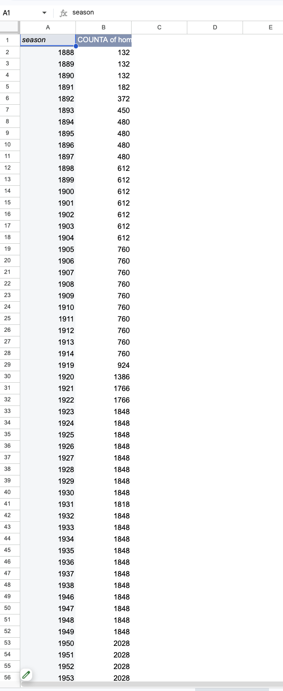
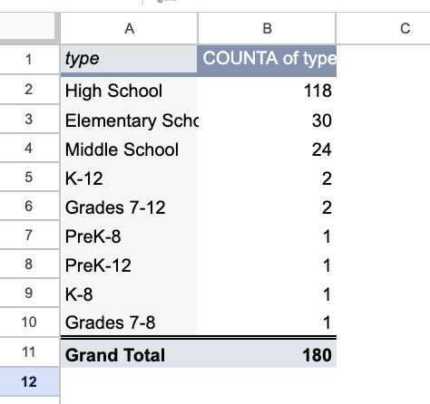
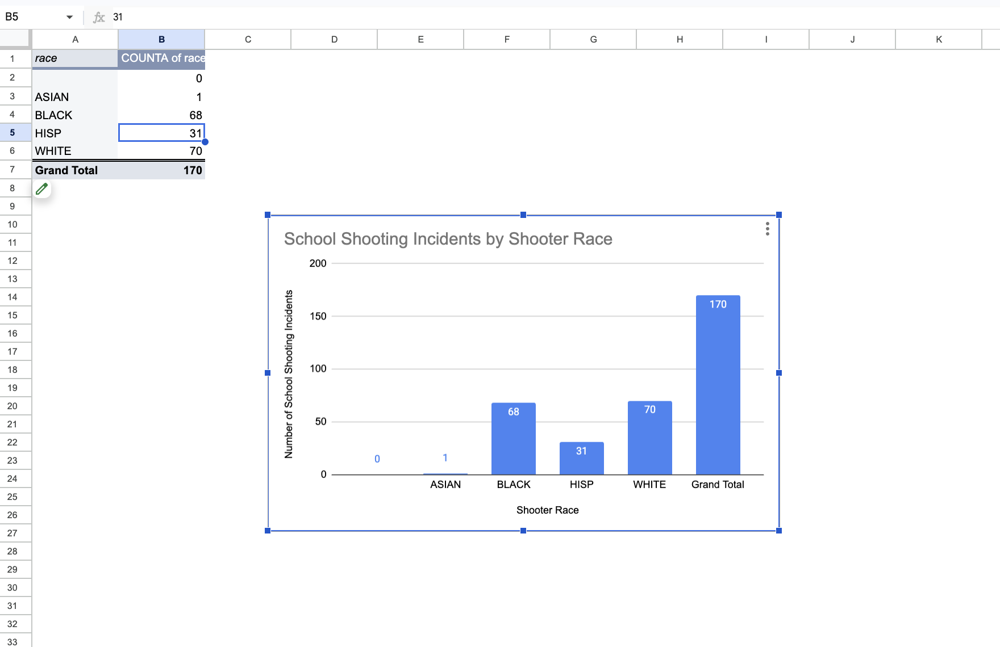
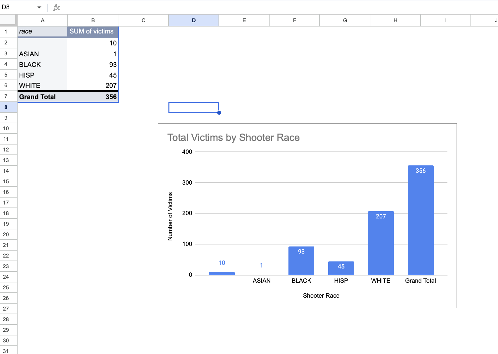
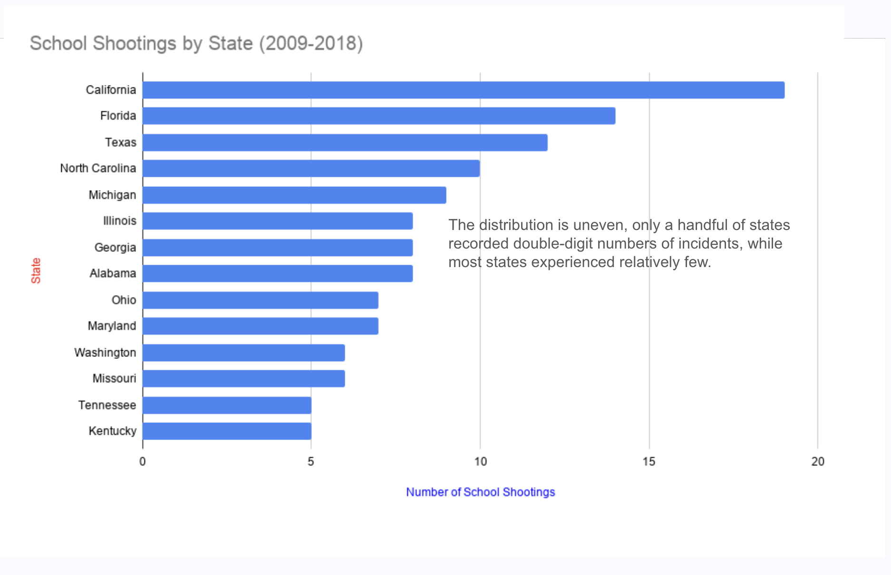
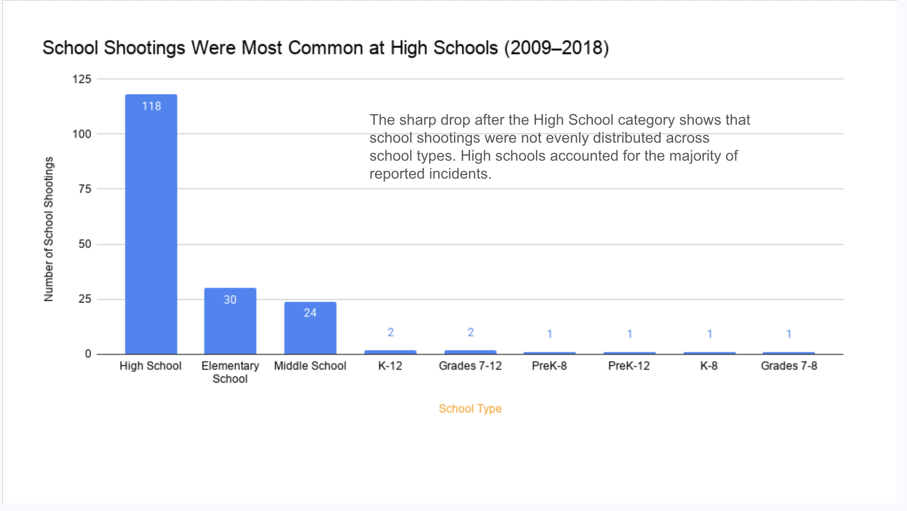

### School Shootings Were Most Common at High Schools (2009-2018)
I found my dataset from the Website Data is Plural. Through the website, I found the source K-12 School Shooting Database which I then downloaded the dataset and put it into a google sheets. The database is maintained by researchers at the Naval Postgraduate School, an academic institution. The database shows times where a gun was fired, or when a bullet struck school property between 1970 and the present. The dataset that I analyzed contains 180 school shootings from 2009–2018, which shows incidents where at least one person was shot.Because the data comes from an academic source with a clearly defined methodology, it is generally trustworthy. I would still verify the information by comparing it with reports from law enforcement, and local news organizations. Datasets should be fact checked before being used. One challenge about this data set that makes it difficult to see if it trust worthy is that the way a "school shooting" is defined can vary between organizations. This database includes any incident in which at least one person was shot on school property during the selected time period, while other organizations may use different definitions or include different types of incidents. The dataset also only covers the years 2009–2018, so it does not represent more recent trends. Additionally,the data may not capture every factor that contributed to each incident, such as mental health history of the shooters or school security measures. These limitations are important to consider when interpreting the results, since the data provides useful information but does not tell the complete story.

My first pivot table counted the number of incidents by state. California had the highest number of recorded incidents with 19, followed by Florida (14), Texas (12), and North Carolina (10). Several other states, including Michigan, Illinois, Georgia, and Alabama, also had relatively high totals, while many states had only one or two recorded incidents. This shows that the incidents in this dataset were not distributed evenly across the United States. However, I found it interesting that the states with the highest counts are also among the country's most populous states. Because this pivot table only reports raw counts, it does not account for differences in population or the number of schools in each state. As a result, these numbers should not be interpreted as showing that these states are necessarily more dangerous than others.
### 
My second pivot table grouped incidents by school type. High schools accounted for 118 of the 180 incidents, making them by far the most common setting in the dataset. Elementary schools had 30 incidents, and middle schools had 24, while K–12 schools and other grade configurations each represented only a small number of cases. I found this result interesting because it suggests that school shootings in this dataset occurred much more frequently at high schools than at elementary or middle schools. One possible explanation is that high schools generally have older students, larger student populations, and different social environments. However, the dataset alone cannot explain why this pattern exists, only that it appears in the recorded data and here is the link to my [Google Sheets page containing my pivot tables and visualizations](https://docs.google.com/spreadsheets/d/1Tas2POrtl05nHjFe89AhOKGiaAej-HQaUFjh1sO6sXg/edit?usp=sharing)
### 
For my third pivot table, I wanted to examine the race of the identified shooters because I was interested in seeing whether one group appeared more frequently in the dataset than others. I thought this was an important variable to explore because it could reveal patterns that are often discussed in the media and show whether the data supports or challenges common assumptions. The pivot table showed that 70 incidents involved White shooters, 68 involved Black shooters, 31 involved Hispanic shooters, and 1 involved an Asian shooter. One interesting finding was that the two largest categories, White and Black shooters, were separated by only two incidents (70 and 68), while the remaining categories accounted for far fewer cases. I also noticed that the total number of incidents in this pivot table is 170 instead of 180, showing that race was not recorded for every case. This highlights an important limitation of the dataset and shows that conclusions should be drawn carefully when some information is missing.
### 
For my fourth pivot table, I wanted to examine the total number of victims associated with each shooter race because I was interested in seeing whether the number of victims differed across the groups in the dataset. Instead of only looking at the number of incidents, this pivot table focuses on the overall impact of those incidents by adding together the total number of victims. The results showed that incidents involving White shooters accounted for the highest total number of victims (207), followed by Black shooters (93), Hispanic shooters (45), and Asian shooters (1). I found this analysis interesting because it demonstrates that the number of incidents and the total number of victims are not always the same measurement. Looking at victim totals provides another perspective on the data and helps illustrate how the severity of incidents can vary across different cases. However, these results should be interpreted carefully, as they do not account for factors such as the number of shooters involved in an incident or the circumstances surrounding each event.
For my first visualization, we can see that school shootings were not evenly distributed across the United States. California had the highest number of incidents in this dataset, followed by Florida, Texas, and North Carolina. However, these totals are raw counts and do not account for differences in population size or the number of schools in each state.
### 
For my first visualization, we can see that school shootings were not evenly distributed across the United States. California had the highest number of incidents in this dataset, followed by Florida, Texas, and North Carolina. However, these totals are raw counts and do not account for differences in population size or the number of schools in each state.
### 
My second visualization shows that high schools accounted for most of the incidents in the dataset, with 118 of the 180 recorded school shootings occurring at high schools. Elementary and middle schools experienced substantially fewer incidents.
### 
## Summary
